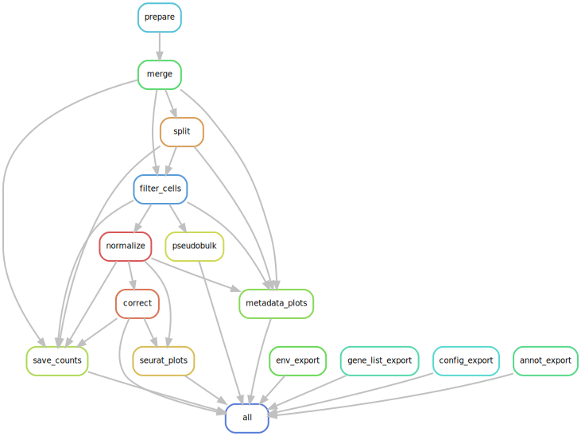

# sc/snRNA-seq Data Processing & Visualization Snakemake Workflow powered by Seurat

A [Snakemake](https://snakemake.readthedocs.io/en/stable/) workflow for processing and visualizing (multimodal) sc/snRNA-seq data generated with [10X Genomics Kits](https://www.10xgenomics.com/) or in the MTX file format powered by the R package [Seurat](https://satijalab.org/seurat/index.html).

This workflow adheres to the module specifications of [MR.PARETO](https://github.com/epigen/mr.pareto), an effort to augment research by modularizing (biomedical) data science. For more details, instructions and modules check out the project's repository. Please consider starring and sharing modules that are useful to you, this helps me in prioritizing my efforts!

**If you use this workflow in a publication, don't forget to give credits to the authors by citing the URL of this (original) repository (and its DOI, see Zenodo badge above -> coming soon).**



Table of contents
----------------
  * [Authors](#authors)
  * [Software](#software)
  * [Methods](#methods)
  * [Features](#features)
  * [Usage](#usage)
  * [Configuration](#configuration)
  * [Examples](#examples)
  * [Links](#links)
  * [Resources](#resources)
  * [Publications](#publications)

# Authors
- [Stephan Reichl](https://github.com/sreichl)
- [Christoph Bock](https://github.com/chrbock)

# Software
This project wouldn't be possible without the following software

| Software       | Reference (DOI)                                   |
| :------------: | :-----------------------------------------------: |
| inspectdf      | https://github.com/alastairrushworth/inspectdf/   |
| data.table     | https://r-datatable.com                           |
| SCTransform    | https://doi.org/10.1186/s13059-019-1874-1         |
| Seurat         | https://doi.org/10.1016/j.cell.2021.04.048        |
| Snakemake      | https://doi.org/10.12688/f1000research.29032.2    |

# Methods
This is a template for the Methods section of a scientific publication and is intended to serve as a starting point. Only retain paragraphs relevant to your analysis. References [ref] to the respective publications are curated in the software table above. Versions (ver) have to be read out from the respective conda environment specifications (workflow/envs/\*.yaml file) or post execution in the result directory (/envs/scrnaseq_processing_seurat/\*.yaml). Parameters that have to be adapted depending on the data or workflow configurations are denoted in squared brackets e.g., [X].

The outlined analyses were performed using the R package Seurat (ver) [ref] unless stated otherwise.

**Merge.** The preprocessed/quantified samples were merged using the function Seurat::merge that concatenates individual samples and their metadata into one Seurat object.

**Metadata.** Metadata was extended with Seurat::PercentageFeatureSet using [X] and by recombination of existing metadata rules [X].

**Guide RNA assignment.** The guide RNA (gRNA) assignment was performed using protospacer call information provided by the CRISPR functionality of 10x Genomics Cell Ranger (ver) [ref], with additional filtering by UMI thresholds [X] to select high-confidence signals. Each cell was assigned all detected gRNAs and inferred KO targets. (optional) To ensure specificity of the phenotype and avoid cell multiplets, only cells with a single gRNA assignment were kept.

**Split.** The merged data set was split into subsets by the metadata column(s) [X].

**Filtering.** The cells were filtered by [X], which resulted in [X] high-quality cells with confident condition and gRNA assignment.

**Pseudobulking.** We performed pseudobulking of single-cell data to aggregate cells based on `[metadata_columns]`, using the `[aggregation_method]` method and with a cell count threshold set at `[cell_count_threshold]` to ensure robust representations. Data from different modalities, including Antibody Capture, CRISPR Guide Capture, and Custom assays, were pseudobulked in the same way. Additionally, the distribution of cell counts across pseudobulked samples was visualized using a histogram and density plot. The resulting pseudobulked data and aggregated metadata were saved for downstream bulk analyses. 

**Normalization.** Filtered count data was normalized using Seurat::SCTransform v2 [ref] with the method parameter glmGamPoi to increase computational efficiency. Other modalities [X] were normalized with Seurat::NormalizeData using method CLR  (Centered Log-Ratio) and margin 2.

**Cell Cycle Scoring.** Cell-cycle scores were determined using the function Seurat::CellCycleScoring using gene lists for M and G2M phase provided by Seurat::cc.genes (Tirosh et al 2015) or [gene lists].

**Cell Scoring.** Cell-module scores were determined using the function Seurat::AddModuleScore using [gene lists].

**Correction.** Filtered count data was normalized and corrected using Seurat::SCTransform [ref] with the method parameter glmGamPoi to increase computational efficiency. Identified confounders [X] were used as covariates to be regressed out.

**Visualization.** To visualize the metadata after each processing step inspectdf (ver) [ref] was used. For the visualization of expression, multimodal [X] data and calculated metadata like module scores, the Seurat functions RidgePlot for ridge plots, VlnPlot for violin plots, DotPlot for dot plots and DoHeatmap for heatmaps were used.

**The processing, analysis and visualizations described here were performed using a publicly available Snakemake [ver] (ref) workflow [ref - cite this workflow here].**


# Features
The workflow perfroms the following steps. Outputs are always in the respective folder `{split}/{step}`.
- Preparation (PREP)
  - Load (mutlimodal) data specified in the annotation file and create a Seurat object.
    - cellranger output directory [feature-barcode matrices MEX](https://support.10xgenomics.com/single-cell-gene-expression/software/pipelines/latest/output/overview#outs-structure) will be loaded with Seurat::Read10X.
    - or data directory with files in MTX format (matrix.mtx, barcodes.tsv, features.tsv) will be loaded with Seurat::ReadMtx.
  - Supported modalities beyond gene expression (RNA) are: Antibody Capture, CRISPR Guide Capture and Custom.
  - (optional) Provided metadata in the annotation file is added to the Seurat object.
  - Metadata is extended with Seurat::PercentageFeatureSet and configured recombination of existing metadata.
  - (CRISPR Guide Capture) Guide RNA and KO target genes are assigned.
    -  CRISPR Guide Capture data is filtered first based on cellranger's and then configured UMI thresholds to retain only significant signals, discarding low-confidence gRNA detections.
    - Remaining counts are used to assign detected gRNAs and inferr KO targets to each cell, generating a list of gRNAs (`gRNAcall`), the count of unique gRNAs (`gRNA_n`), a list of KO targets (`KOcall`), and the count of unique KOs (`KO_n`) for each cell.
    - Both, gRNAcall and KOcall are alphabetically ordered concatenated values in snakecase e.g., geneA_geneB.
    - Note: Cells with different gRNA's targeting the same gene are gRNA multiplets (i.e., gRNA_n>1), but KO singlets (i.e., KO_n=1).
    - Note: gRNA multiplets could be indicative of cell-doublets/multiplets. e.g., gRNAcall: geneX-1_geneX-2 -> KOcall: geneX
    - Tip: To filter for cells with only one gRNA assigned use the logical expression `gRNA_n == 1` in the filter configuration.
  - One Seurat object per sample is saved.
- Merge & Split into subsets (RAW)
  - Merge all samples into one large object, including metadata, called "merged".
  - (optional) Externally provided metadata (e.g., labels from downstream cluster analysis) is added.
  - Split the merged data into subsets using metadata (`{metadata_column}__{metadata_value}`).

The following steps are performed on each data split separately (including the "merged" split).

- Filtering (FILTERED)
  - Filter cells by a combination of logical-expressions using the metadata.
- Pseudobulking (PSEUDOBULK)
  - Pseudobulking is performed based on metadata columns specified by the user, with options for aggregation methods including sum, mean, or median.
  - A cell count threshold is applied to remove pseudobulked samples with fewer cells than specified.
  - The aggregated metadata and pseudobulked data are saved as CSV files to be used for downstream bulk analyses.
  - A histogram and density plot visualizing the distribution of cell counts in pseudobulked samples are provided.
  - Other modalities are also pseudobulked, if applicable.
- Normalization (NORMALIZED)
  - Normalization of gene expression data using [SCTransform v2 (vst.flavor = "v2")](https://genomebiology.biomedcentral.com/articles/10.1186/s13059-021-02584-9), returning normalized values for all expressed genes, filtered by minimum cells per gene parameter.
  - Normalization of all multimodal data using Centered Log-Ratio (CLR) with margin 2.
  - Dynamic highly variable gene (HVG) determination using a residual variance threshold of 1.3 (default). Returning bot a table with statistics and a sorted list of all HVGs.
- Cell Scoring
  - Cell cycle scoring using Seurat::CellCycleScoring and provided S2- and G2M genes.
  - Gene module scoring using Seurat::AddModuleScore and provided gene lists.
  - All scores and HVGs are determined based on normalized data, not corrected. To avoid redundancy, HVGs are only provided in the NORMALIZED step.
- Correction (CORRECTED)
  - Normalization and correction for the list of provided confounders using [SCTransform v2 (vst.flavor = "v2")](https://genomebiology.biomedcentral.com/articles/10.1186/s13059-021-02584-9), returning scaled values for all expressed genes.
  - The correction is only present in the scaled values (slot="scale.data"), hence only scaled values are saved as CSV, if configured.
  - Corrected data is useful for downstream analyses like dimensionality redcution and clustering, not differential gene expression analysis.
- Visualization using Ridge-, Violin-, Dot-plots and Heatmaps `{split}/{step}/plots/{plot_type}/{category}/{feature_list}/*.png`
  - Configuration
    - Gene lists for plotting gene expression data can be provided as plain text files with one gene per line. The top 100 HVGs are always plotted.
    - Feature lists for other modalities can be provided directly in the configuration file.
    - The visualization category/group (vis_categories) indicates the metadata column by which cells are grouped within all plots.
  - Metadata
    - Visualization after each procesing step using inspectdf for all numerical and categorical metadata.
    - Ridge-, Violin-, Dot-plots and Heatmaps (e.g., useful to compare gene module scores).
  - Gene expression (RNA) is always plotted after normalization (slot="data") and correction (slot="scale.data"), respectively.
    - Ridge-, Violin-, Dot-plots and Heatmaps.
    - In step NORMALIZED normalized data (slot="data") is visualized, in step CORRECTED corrected data (slot="scale.data") is visualized.
  - (optional) Other modalities are only visualized after normalization (using slot="data") using Ridge-, Violin-, Dot-plots and Heatmaps.
  - Plot types
    - Metadata plots using inspectdf.
    - Ridge- & Violin-plots are plotted per gene/feature.
    - Dot plots are only generated for NORMALIZED data (slot="data"). Before plotting, averaging and scaling (Min-Maxed based) is performed.
    - Heatmaps always show scaled data (slot="scale.data") and features (rows) are hierachically clustered. In case of >30,000 cells the cells are downsampled to the same size per catgory, which is the smallest among all groups but a minimum of 100 cells.
- Report: all visualizations, metadata and configuration/annotation files are provided in the Snakemake report.
- Save counts
  - Functionality to save all counts should be saved as CSV after each processing step for of all modalities. Useful for downstream analyses that are independent of Seurat.
- Results: all results will be saved in the configured result path, where for each data(sub)set (`split`) a directory with the following structure is created within`scrnaseq_processing_seurat/`:
  -  `{split}/{step}` for all the .rds object files and .CSV files.
     -  `plots/{plot_type}/{category}/{feature_list}/*.png` for all visualizations.
     -  `stats/` for all metadata derived statistics.

# Usage
Here are some tips for the usage of this workflow:
- Use short sample names in sample_annotation sheet, because they will be the prefix for each barcode/cell in the merged & split datasets.
- Run the workflow for each step of processing (with the stop_after parameter) and investigate the results (e.g., using the Snakemake report function).
- Start with a low complexity in the configuration.
- Try to finish the analysis of the "merged" data set first, and later split the data by using the split_by parameter.
- In case you want to repeat your analysis based on metadata that emerged from downstream analyses (e.g., clustering, cell-type annotation, perturbation classification) you can provide an incomplete metadatafile in the configuration (i.e., not all cells/barcodes hvae to be present in the metadata). Changes in this file will trigger a rerun of the workflow starting with the merging step to ensure the added metadta is considered in all downstream steps (e.g., splitting, visualization, etc.).

# Configuration
Detailed specifications can be found here [./config/README.md](./config/README.md)

# Example
We selected a scRNA-seq data set consisting of 15 CRC samples from [Lee et al (2020) Lineage-dependent gene expression programs influence the immune landscape of colorectal cancer. Nature Genetics](https://doi.org/10.1038/s41588-020-0636-z). Downloaded from the [Weizmann Institute - Curated Cancer Cell Atlas (3CA) - Colorectal Cancer](https://www.weizmann.ac.il/sites/3CA/colorectal) section.
- samples/patients: 15
- cells: 21657
- features (genes): 22276
- total runtime on HPC w/ SLURM (32GB RAM): <24 minutes for 551 jobs in total

We provide metadata, annotation and configuration files for this data set in ./test. The UMI count martix has to be downloaded by following the instructions below.
```bash
### Download example CRC scRNA-seq data from Lee 2020 Nature Genetics

# Start from repo root
cd scrnaseq_processing_seurat

# Download the .zip file
wget -O data.zip "https://www.dropbox.com/sh/pvauenviguopkue/AADVbccY9ueRVAFTeJEEPxRwa?dl=1" || curl -L "https://www.dropbox.com/sh/pvauenviguopkue/AADVbccY9ueRVAFTeJEEPxRwa?dl=1" -o data.zip

# Unzip and delete the .zip archive
unzip data.zip -d Data_Lee2020_Colorectal
rm data.zip

# Move and rename the UMI count matrix
mv Data_Lee2020_Colorectal/Exp_data_UMIcounts.mtx test/data/Lee2020NatGenet/matrix.mtx

# Remove the unzipped folder
rm -r Data_Lee2020_Colorectal
```

Beyond this the workflow was tested on multimodal scCRISPR-seq data sets with >350,000 cells and 340 different KO groups (<4h; 99 jobs; 256GB RAM).

# Links
- [GitHub Repository](https://github.com/epigen/scrnaseq_processing_seurat/)
- [GitHub Page](https://epigen.github.io/scrnaseq_processing_seurat/)
- [Zenodo Repository (coming soon)]()
- [Snakemake Workflow Catalog Entry](https://snakemake.github.io/snakemake-workflow-catalog?usage=epigen/scrnaseq_processing_seurat)

# Resources
- Data Resources for scRNA-seq data in compatible MTX format
  - [10X Genomics Datasets](https://www.10xgenomics.com/datasets)
  - [CELLxGENE](https://cellxgene.cziscience.com/)
  - [HCA Data Portal](https://data.humancellatlas.org/)
  - [Weizmann Curated Cancer Cell Atlas](https://www.weizmann.ac.il/sites/3CA/)
- Recommended [MR.PARETO](https://github.com/epigen/mr.pareto) modules for downstream analyses (in that order):
  - [Unsupervised Analysis](https://github.com/epigen/unsupervised_analysis) to understand and visualize similarities and variations between cells/samples, including dimensionality reduction and cluster analysis. Useful for both single-cell and pseudbulked data.
  - Single-cell analysis using Seurat
    - [Differential Analysis using Seurat](https://github.com/epigen/dea_seurat) to identify and visualize statistically significantly differentially expressed genes between groups.
    - [Perturbation Analysis using Mixscape from Seurat](https://github.com/epigen/mixscape_seurat) to identify perturbed cells from pooled (multimodal) CRISPR screens with sc/snRNA-seq read-out (scCRISPR-seq).
  - Pseudobulked data/samples:
    - [<ins>Sp</ins>lit, F<ins>ilter</ins>, Norma<ins>lize</ins> and <ins>Integrate</ins> Sequencing Data](https://github.com/epigen/spilterlize_integrate/) pseudobulked samples post processing.
    - [Differential Analysis with limma](https://github.com/epigen/dea_limma) to identify and visualize statistically significantly differentially expressed genes between sample groups.
  - [Enrichment Analysis](https://github.com/epigen/enrichment_analysis) for biomedical interpretation of differential analysis results using prior knoweledge.


# Publications
The following publications successfully used this module for their analyses.
- ...
